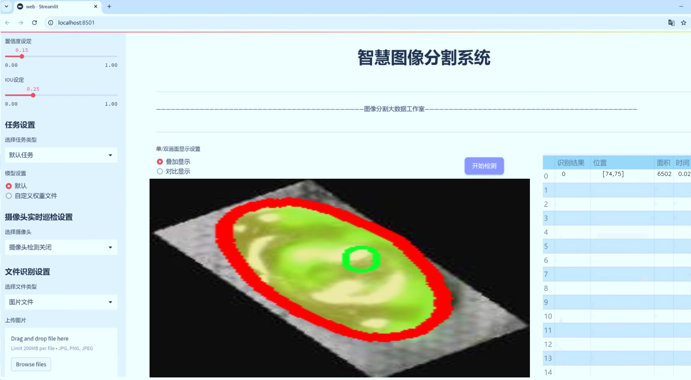
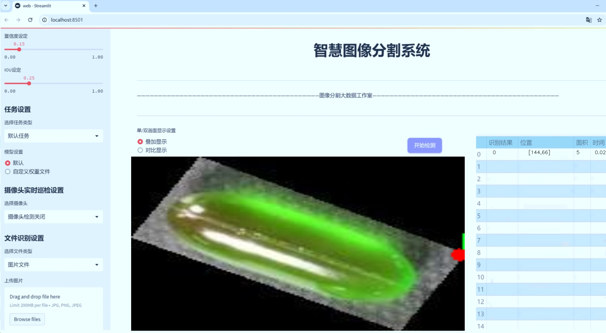
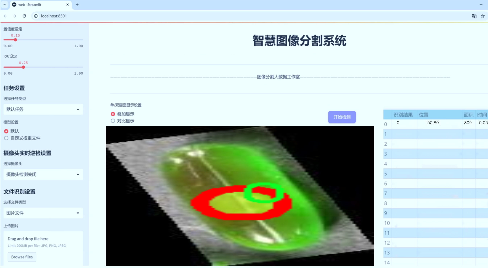
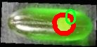
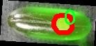
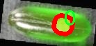
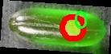
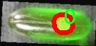

# 胶囊表面缺陷图像分割系统： yolov8-seg-repvit

### 1.研究背景与意义

[参考博客](https://gitee.com/YOLOv8_YOLOv11_Segmentation_Studio/projects)

[博客来源](https://kdocs.cn/l/cszuIiCKVNis)

研究背景与意义

随着现代制造业的迅速发展，产品质量的控制与提升已成为各行业关注的重点。在制药行业中，胶囊作为药物的主要载体，其表面缺陷的检测与分割显得尤为重要。胶囊表面缺陷不仅影响药物的外观质量，还可能对药物的安全性和有效性产生直接影响。因此，开发一种高效、准确的胶囊表面缺陷图像分割系统，对于保障药品质量、提高生产效率具有重要的现实意义。

近年来，深度学习技术在计算机视觉领域取得了显著进展，尤其是在目标检测和图像分割任务中表现出色。YOLO（You Only Look Once）系列模型以其快速和高效的特性，成为实时目标检测的热门选择。YOLOv8作为该系列的最新版本，进一步提升了检测精度和速度，具有较强的适应性和灵活性。然而，传统YOLOv8模型在处理复杂背景和细小缺陷时，仍然存在一定的局限性。因此，基于改进YOLOv8的胶囊表面缺陷图像分割系统的研究，旨在克服这些不足，提高胶囊表面缺陷的检测与分割精度。

本研究将利用包含1600张胶囊图像的数据集进行模型训练与验证。该数据集的构建为研究提供了坚实的基础，涵盖了胶囊表面缺陷的多样性，能够有效地反映实际生产中的问题。通过对该数据集的深入分析与处理，能够为模型的改进提供重要的参考依据。特别是在缺陷类别数量较少的情况下，如何通过数据增强、迁移学习等技术，提升模型的泛化能力，将是本研究的重点之一。

此外，胶囊表面缺陷的自动检测与分割，不仅能够减少人工检测的工作量，提高检测效率，还能降低人为因素带来的误差，从而提升整体生产质量。通过引入改进的YOLOv8模型，研究将探索如何在保持高检测速度的同时，提升分割精度，确保对胶囊表面缺陷的准确识别。这一研究不仅具有重要的理论价值，也为实际生产提供了可行的解决方案。

综上所述，基于改进YOLOv8的胶囊表面缺陷图像分割系统的研究，具有重要的学术意义和应用价值。它不仅推动了深度学习在工业检测领域的应用，还为胶囊生产企业提供了先进的技术支持，助力于实现智能制造和高效生产。通过本研究的深入开展，期望能够为胶囊表面缺陷的自动化检测提供新的思路和方法，推动相关领域的技术进步与创新。

### 2.图片演示







注意：本项目提供完整的训练源码数据集和训练教程,由于此博客编辑较早,暂不提供权重文件（best.pt）,需要按照6.训练教程进行训练后实现上图效果。

### 3.视频演示

[3.1 视频演示](https://www.bilibili.com/video/BV17QBkYDE66/)

### 4.数据集信息

##### 4.1 数据集类别数＆类别名

nc: 1
names: ['0']


##### 4.2 数据集信息简介

数据集信息展示

在本研究中，我们构建了一个专门用于训练改进YOLOv8-seg的胶囊表面缺陷图像分割系统的数据集，命名为“capsule”。该数据集的设计旨在为胶囊表面缺陷的自动检测与分割提供高质量的图像数据支持，以提升深度学习模型在实际应用中的表现。数据集的核心特征在于其单一类别的设定，具体类别数量为1，类别列表仅包含一个名称“0”。这一设计选择反映了我们对胶囊表面缺陷检测任务的聚焦，旨在简化模型的训练过程，同时确保模型能够在特定的缺陷类型上达到最佳的分割效果。

“capsule”数据集包含了大量的胶囊表面图像，这些图像均经过精心标注，确保每个图像中的缺陷区域能够被准确识别和分割。数据集中的图像涵盖了多种不同的胶囊表面缺陷类型，如划痕、气泡、颜色不均匀等，尽管在类别上统一为“0”，但在图像内容上却呈现出丰富的多样性。这种多样性不仅增强了模型的泛化能力，也使得模型在面对实际应用场景中的复杂情况时，能够表现出更高的鲁棒性。

在数据集的构建过程中，我们采用了多种图像采集技术，确保所获得的图像在光照、角度和背景等方面具有一定的变化。这种变化有助于模型学习到不同环境下胶囊表面缺陷的特征，从而提升其在真实场景中的应用效果。此外，数据集还包含了一些经过增强处理的图像，如旋转、缩放和颜色调整等，以进一步丰富训练样本的多样性。这些增强手段不仅提高了数据集的有效性，也为模型提供了更多的学习机会。

为了确保数据集的质量，我们在标注过程中采用了严格的标准，所有缺陷区域均由经验丰富的标注人员进行人工标注，确保每个缺陷的边界清晰可见。这种高质量的标注是训练高效模型的基础，有助于模型在分割任务中获得更好的表现。经过多轮的验证与修正，最终形成的“capsule”数据集在标注精度和图像质量上均达到了较高的标准。

在模型训练阶段，我们将“capsule”数据集分为训练集、验证集和测试集，以便于对模型的性能进行全面评估。训练集用于模型的学习，验证集用于调整模型参数，而测试集则用于最终的性能评估。通过这种分割方式，我们能够更好地监控模型的训练过程，及时发现并解决潜在的问题。

综上所述，“capsule”数据集为改进YOLOv8-seg的胶囊表面缺陷图像分割系统提供了坚实的数据基础。其单一类别的设计、丰富的图像内容以及高质量的标注，均为模型的训练和优化奠定了良好的基础。随着该数据集的不断完善和扩展，我们期望能够进一步提升胶囊表面缺陷检测的自动化水平，为相关领域的研究和应用提供更为强大的支持。











### 5.项目依赖环境部署教程（零基础手把手教学）

[5.1 环境部署教程链接（零基础手把手教学）](https://www.bilibili.com/video/BV1jG4Ve4E9t/?vd_source=bc9aec86d164b67a7004b996143742dc)


[5.2 安装Python虚拟环境创建和依赖库安装视频教程链接（零基础手把手教学）](https://www.bilibili.com/video/BV1nA4VeYEze/?vd_source=bc9aec86d164b67a7004b996143742dc)

### 6.手把手YOLOV8-seg训练视频教程（零基础手把手教学）

[6.1 手把手YOLOV8-seg训练视频教程（零基础小白有手就能学会）](https://www.bilibili.com/video/BV1cA4VeYETe/?vd_source=bc9aec86d164b67a7004b996143742dc)


按照上面的训练视频教程链接加载项目提供的数据集，运行train.py即可开始训练



     Epoch   gpu_mem       box       obj       cls    labels  img_size
     1/200     0G   0.01576   0.01955  0.007536        22      1280: 100%|██████████| 849/849 [14:42<00:00,  1.04s/it]
               Class     Images     Labels          P          R     mAP@.5 mAP@.5:.95: 100%|██████████| 213/213 [01:14<00:00,  2.87it/s]
                 all       3395      17314      0.994      0.957      0.0957      0.0843

     Epoch   gpu_mem       box       obj       cls    labels  img_size
     2/200     0G   0.01578   0.01923  0.007006        22      1280: 100%|██████████| 849/849 [14:44<00:00,  1.04s/it]
               Class     Images     Labels          P          R     mAP@.5 mAP@.5:.95: 100%|██████████| 213/213 [01:12<00:00,  2.95it/s]
                 all       3395      17314      0.996      0.956      0.0957      0.0845

     Epoch   gpu_mem       box       obj       cls    labels  img_size
     3/200     0G   0.01561    0.0191  0.006895        27      1280: 100%|██████████| 849/849 [10:56<00:00,  1.29it/s]
               Class     Images     Labels          P          R     mAP@.5 mAP@.5:.95: 100%|███████   | 187/213 [00:52<00:00,  4.04it/s]
                 all       3395      17314      0.996      0.957      0.0957      0.0845


### 7.50+种全套YOLOV8-seg创新点加载调参实验视频教程（一键加载写好的改进模型的配置文件）

[7.1 50+种全套YOLOV8-seg创新点加载调参实验视频教程（一键加载写好的改进模型的配置文件）](https://www.bilibili.com/video/BV1Hw4VePEXv/?vd_source=bc9aec86d164b67a7004b996143742dc)

### YOLOV8-seg算法简介

原始YOLOV8-seg算法原理

YOLOv8-seg算法是由Ultralytics公司于2023年推出的YOLO系列最新版本，代表了目标检测和分割领域的前沿技术。YOLOv8的设计理念是以速度和精度为核心，旨在满足现代计算机视觉应用对实时性和准确性的双重需求。该算法不仅继承了YOLO系列的优良传统，还在结构和功能上进行了显著的创新，尤其是在目标分割任务中的应用。

YOLOv8-seg的网络结构可以分为三个主要部分：Backbone（骨干网络）、Neck（颈部结构）和Head（头部结构）。在Backbone部分，YOLOv8采用了CSP（Cross Stage Partial）结构，这种结构通过将特征提取过程分为两个阶段，分别进行卷积和连接，从而有效地减轻了模型的计算负担，并提高了特征提取的效率。具体而言，CSP结构通过跨级连接的方式，增强了特征的多样性和表达能力，使得模型能够更好地捕捉到目标的细节信息。

在Neck部分，YOLOv8-seg引入了PAN-FPN（Path Aggregation Network - Feature Pyramid Network）结构，旨在实现多尺度特征的融合。PAN-FPN通过对不同层次的特征进行聚合，能够有效地提升模型对不同尺寸目标的检测能力。这一设计使得YOLOv8-seg在处理复杂场景时，能够更好地应对目标的尺度变化，进而提高了检测的准确性。

YOLOv8-seg的Head部分则采用了Anchor-Free的检测方式，摒弃了传统的锚框机制，简化了目标检测的过程。该部分使用了解耦头结构，允许模型在进行目标分类和边界框回归时，能够独立处理各自的任务，从而提升了整体的检测性能。此外，YOLOv8-seg还引入了新的损失函数策略，包括变焦损失（Focal Loss）和完美交并比损失（Perfect IoU Loss），这些策略旨在优化模型在分类和定位任务中的表现，使得模型在面对复杂背景和小目标时，依然能够保持高效的检测能力。

在具体实现上，YOLOv8-seg通过灵活的模型设置，允许用户根据实际需求调整模型的深度和宽度。通过设置depth_factor和width_factor参数，用户可以根据不同的应用场景，选择合适的模型规模，从而在精度和速度之间找到最佳平衡。这种灵活性使得YOLOv8-seg在各种硬件平台上都能得到良好的支持，进一步拓宽了其应用范围。

YOLOv8-seg在目标分割任务中的表现尤为突出。通过在检测的基础上增加分割的功能，YOLOv8-seg能够不仅识别目标的类别，还能精确地划分目标的边界。这一能力在许多实际应用中具有重要意义，例如在自动驾驶、医学影像分析和智能监控等领域，能够提供更为丰富和细致的信息。

在训练过程中，YOLOv8-seg采用了数据增强和自适应学习率等技术，以提高模型的泛化能力和训练效率。通过对训练数据进行多样化处理，模型能够更好地适应不同的场景和目标特征，从而在实际应用中表现出色。此外，YOLOv8-seg还支持自定义数据集的训练，使得用户能够根据特定需求，快速构建适合自身应用的目标检测和分割模型。

总的来说，YOLOv8-seg算法通过对YOLO系列的持续优化和创新，展现了其在目标检测和分割领域的强大能力。其独特的网络结构设计、灵活的模型设置以及高效的训练策略，使得YOLOv8-seg成为了当前计算机视觉领域最具竞争力的算法之一。随着技术的不断进步，YOLOv8-seg有望在更多实际应用中发挥重要作用，推动目标检测和分割技术的进一步发展。


### 9.系统功能展示（检测对象为举例，实际内容以本项目数据集为准）

图9.1.系统支持检测结果表格显示

  图9.2.系统支持置信度和IOU阈值手动调节

  图9.3.系统支持自定义加载权重文件best.pt(需要你通过步骤5中训练获得)

  图9.4.系统支持摄像头实时识别

  图9.5.系统支持图片识别

  图9.6.系统支持视频识别

  图9.7.系统支持识别结果文件自动保存

  图9.8.系统支持Excel导出检测结果数据


### 10.50+种全套YOLOV8-seg创新点原理讲解（非科班也可以轻松写刊发刊，V11版本正在科研待更新）

#### 10.1 由于篇幅限制，每个创新点的具体原理讲解就不一一展开，具体见下列网址中的创新点对应子项目的技术原理博客网址【Blog】：


[10.1 50+种全套YOLOV8-seg创新点原理讲解链接](https://gitee.com/qunmasj/good)

#### 10.2 部分改进模块原理讲解(完整的改进原理见上图和技术博客链接)【如果此小节的图加载失败可以通过CSDN或者Github搜索该博客的标题访问原始博客，原始博客图片显示正常】
### 深度学习基础
卷积神经网络通过使用具有共享参数的卷积运算显著降低了模型的计算开销和复杂性。在LeNet、AlexNet和VGG等经典网络的驱动下，卷积神经网络现在已经建立了一个完整的系统，并在深度学习领域形成了先进的卷积神经网络模型。

感受野注意力卷积RFCBAMConv的作者在仔细研究了卷积运算之后获得了灵感。对于分类、目标检测和语义分割任务，一方面，图像中不同位置的对象的形状、大小、颜色和分布是可变的。在卷积操作期间，卷积核在每个感受野中使用相同的参数来提取信息，而不考虑来自不同位置的差分信息。这限制了网络的性能，这已经在最近的许多工作中得到了证实。

另一方面，卷积运算没有考虑每个特征的重要性，这进一步影响了提取特征的有效性，并最终限制了模型的性能。此外，注意力机制允许模型专注于重要特征，这可以增强特征提取的优势和卷积神经网络捕获详细特征信息的能力。因此，注意力机制在深度学习中得到了广泛的应用，并成功地应用于各个领域。

通过研究卷积运算的内在缺陷和注意力机制的特点，作者认为现有的空间注意力机制从本质上解决了卷积运算的参数共享问题，但仍局限于对空间特征的认知。对于较大的卷积核，现有的空间注意力机制并没有完全解决共享参数的问题。此外，他们无法强调感受野中每个特征的重要性，例如现有的卷积块注意力模块（CBAM）和 Coordinate注意力（CA）。

因此，[参考该博客提出了一种新的感受野注意力机制（RFA）](https://qunmasj.com)，它完全解决了卷积核共享参数的问题，并充分考虑了感受野中每个特征的重要性。通过RFA设计的卷积运算（RFAConv）是一种新的卷积运算，可以取代现有神经网络中的标准卷积运算。RFAConv通过添加一些参数和计算开销来提高网络性能。

大量关于Imagnet-1k、MS COCO和VOC的实验已经证明了RFAConv的有效性。作为一种由注意力构建的新型卷积运算，它超过了由CAM、CBAM和CA构建的卷积运算（CAMConv、CBAMConv、CAConv）以及标准卷积运算。

此外，为了解决现有方法提取感受野特征速度慢的问题，提出了一种轻量级操作。在构建RFAConv的过程中，再次设计了CA和CBAM的升级版本，并进行了相关实验。作者认为当前的空间注意力机制应该将注意力放在感受野空间特征上，以促进当前空间注意力机制的发展，并再次增强卷积神经网络架构的优势。


### 卷积神经网络架构
出色的神经网络架构可以提高不同任务的性能。卷积运算作为卷积神经网络的一种基本运算，推动了人工智能的发展，并为车辆检测、无人机图像、医学等先进的网络模型做出了贡献。He等人认为随着网络深度的增加，该模型将变得难以训练并产生退化现象，因此他们提出了残差连接来创新卷积神经网络架构的设计。Huang等人通过重用特征来解决网络梯度消失问题，增强了特征信息，他们再次创新了卷积神经网络架构。

通过对卷积运算的详细研究，Dai等人认为，具有固定采样位置的卷积运算在一定程度上限制了网络的性能，因此提出了Deformable Conv，通过学习偏移来改变卷积核的采样位置。在Deformable Conv的基础上，再次提出了Deformable Conv V2和Deformable Conv V3，以提高卷积网络的性能。

Zhang等人注意到，组卷积可以减少模型的参数数量和计算开销。然而，少于组内信息的交互将影响最终的网络性能。1×1的卷积可以与信息相互作用。然而，这将带来更多的参数和计算开销，因此他们提出了无参数的“通道Shuffle”操作来与组之间的信息交互。

Ma等人通过实验得出结论，对于参数较少的模型，推理速度不一定更快，对于计算量较小的模型，推理也不一定更快。经过仔细研究提出了Shufflenet V2。

YOLO将输入图像划分为网格，以预测对象的位置和类别。经过不断的研究，已经提出了8个版本的基于YOLO的目标检测器，如YOLOv5、YOLOv7、YOLOv8等。上述卷积神经网络架构已经取得了巨大的成功。然而，它们并没有解决提取特征过程中的参数共享问题。本文的工作从注意力机制开始，从一个新的角度解决卷积参数共享问题。

### 注意力机制
注意力机制被用作一种提高网络模型性能的技术，使其能够专注于关键特性。注意力机制理论已经在深度学习中建立了一个完整而成熟的体系。Hu等人提出了一种Squeeze-and-Excitation（SE）块，通过压缩特征来聚合全局通道信息，从而获得与每个通道对应的权重。Wang等人认为，当SE与信息交互时，单个通道和权重之间的对应关系是间接的，因此设计了高效通道注Efficient Channel Attention力（ECA），并用自适应kernel大小的一维卷积取代了SE中的全连接（FC）层。Woo等人提出了卷积块注意力模块（CBAM），它结合了通道注意力和空间注意力。作为一个即插即用模块，它可以嵌入卷积神经网络中，以提高网络性能。

尽管SE和CBAM已经提高了网络的性能。Hou等人仍然发现压缩特征在SE和CBAM中丢失了太多信息。因此，他们提出了轻量级Coordinate注意力（CA）来解决SE和CBAM中的问题。Fu等人计了一个空间注意力模块和通道注意力模块，用于扩展全卷积网络（FCN），分别对空间维度和通道维度的语义相关性进行建模。Zhang等人在通道上生成不同尺度的特征图，以建立更有效的通道注意力机制。

本文从一个新的角度解决了标准卷积运算的参数共享问题。这就是将注意力机制结合起来构造卷积运算。尽管目前的注意力机制已经获得了良好的性能，但它们仍然没有关注感受野的空间特征。因此，设计了具有非共享参数的RFA卷积运算，以提高网络的性能。


#### 回顾标准卷积
以标准卷积运算为基础构建卷积神经网络，通过共享参数的滑动窗口提取特征信息，解决了全连接层构建的神经网络的固有问题（即参数数量大、计算开销高）。

设表示输入特征图，其中、和分别表示特征图的通道数、高度和宽度。为了能够清楚地展示卷积核提取特征信息的过程，以为例。提取每个感受野slider的特征信息的卷积运算可以表示如下：


这里，表示在每次卷积slider操作之后获得的值，表示在每个slider内的相应位置处的像素值。表示卷积核，表示卷积核中的参数数量，表示感受野slider的总数。

可以看出，每个slider内相同位置的特征共享相同的参数。因此，标准的卷积运算无法感知不同位置带来的差异信息，这在一定程度上限制了卷积神经网络的性能。

#### 回顾空间注意力
目前，空间注意力机制使用通过学习获得的注意力图来突出每个特征的重要性。与上一节类似，以为例。突出关键特征的空间注意力机制可以简单地表达如下：


这里，表示在加权运算之后获得的值。和分别表示输入特征图和学习注意力图在不同位置的值，是输入特征图的高度和宽度的乘积，表示像素值的总数。一般来说，整个过程可以简单地表示在图1中。


#### 空间注意力与标准卷积
众所周知，将注意力机制引入卷积神经网络可以提高网络的性能。通过标准的卷积运算和对现有空间注意力机制的仔细分析。作者认为空间注意力机制本质上解决了卷积神经网络的固有缺点，即共享参数的问题。

目前，该模型最常见的卷积核大小为1×1和3×3。引入空间注意力机制后用于提取特征的卷积操作是1×1或3×3卷积操作。这个过程可以直观地显示出来。空间注意力机制被插入到1×1卷积运算的前面。通过注意力图对输入特征图进行加权运算（Re-weight“×”），最后通过1×1卷积运算提取感受野的slider特征信息。

整个过程可以简单地表示如下：


 

这里，卷积核仅表示一个参数值。如果将的值作为一个新的卷积核参数，那么有趣的是，通过1×1卷积运算提取特征时的参数共享问题得到了解决。然而，空间注意力机制的传说到此结束。当空间注意力机制被插入到3×3卷积运算的前面时。具体情况如下：


如上所述，如果取的值。作为一种新的卷积核参数，上述方程完全解决了大规模卷积核的参数共享问题。然而，最重要的一点是，卷积核在每个感受野slider中提取将共享部分特征的特征。换句话说，在每个感受野slider内都会有重叠。

经过仔细分析发现，，…，空间注意力图的权重在每个slider内共享。因此，空间注意机制不能解决大规模卷积核共享参数的问题，因为它们不注意感受野的空间特征。在这种情况下，空间注意力机制是有限的。
#### 创新空间注意力与标准卷积
RFA是为了解决空间注意力机制问题而提出的，创新了空间注意力。使用与RFA相同的思想，一系列空间注意力机制可以再次提高性能。RFA设计的卷积运算可以被视为一种轻量级的即插即用模块，以取代标准卷积，从而提高卷积神经网络的性能。因此，作者认为空间注意力机制和标准卷积在未来将有一个新的春天。

感受野的空间特征：

现在给出感受野空间特征的定义。它是专门为卷积核设计的，并根据kernel大小动态生成，如图2所示，以3×3卷积核为例。


在图2中，“空间特征”表示原始特征图，等于空间特征。“感受野空间特征”表示变换后的特征，该特征由每个感受野slider滑块组成，并且不重叠。也就是说，“感受野空间特征”中的每个3×3大小的slider表示提取原始3×3卷积特征时所有感觉野slider的特征。

#### 感受野注意力卷积(RFA):

关于感受野空间特征，该博客的作者提出了感受野注意（RFA），它不仅强调了感受野slider内各种特征的重要性，而且还关注感受野空间特性，以彻底解决卷积核参数共享的问题。感受野空间特征是根据卷积核的大小动态生成的，因此，RFA是卷积的固定组合，不能脱离卷积运算的帮助，卷积运算同时依赖RFA来提高性能。

因此，作者提出了感受野注意力卷积（RFAConv）。具有3×3大小卷积核的RFAConv的总体结构如图3所示。


目前，提取感受野特征最常用的方法速度较慢，因此经过不断探索提出了一种快速的方法，通过分组卷积来取代原来的方法。

具体来说，根据感受野大小，使用相应的组卷积大小来动态生成展开特征。尽管与原始的无参数方法（如Pytorch提供的nn.Unfld()）相比，该方法添加了一些参数，但速度要快得多。

注意：正如在上一节中提到的，当原始的3×3卷积核提取特征时，感受野空间特征中的每个3×3大小的窗口表示所有感受野滑块的特征。但在快速分组卷积提取感受野特征后，由于原始方法太慢，它们会被映射到新的特征中。

最近的一些工作已经证明信息交互可以提高网络性能。类似地，对于RFAConv，与感受野特征信息交互以学习注意力图可以提高网络性能，但与每个感受野特征交互将带来额外的计算开销。为了确保少量的计算开销和参数数量，通过探索使用AvgPool池化每个感受野特征的全局信息，然后通过1×1组卷积运算与信息交互。最后，softmax用于强调感受野特征中每个特征的重要性。通常，RFA的计算可以表示为：


表示分组卷积，表示卷积核的大小，代表规范化，表示输入特征图，是通过将注意力图与变换的感受野空间特征相乘而获得的。

与CBAM和CA不同，RFA可以为每个感受野特征生成注意力图。标准卷积受到卷积神经网络性能的限制，因为共享参数的卷积运算对位置带来的差异信息不敏感。RFA完全可以解决这个问题，具体细节如下：


由于RFA获得的特征图是“调整形状”后不重叠的感受野空间特征，因此通过池化每个感受野滑块的特征信息来学习学习的注意力图。换句话说，RFA学习的注意力图不再在每个感受野slider内共享，并且是有效的。这完全解决了现有的CA和CBAM对大尺寸kernel的注意力机制中的参数共享问题。

同时，RFA给标准卷积核带来了相当大的好处，但调整形状后，特征的高度和宽度是k倍，需要进行k×k的stride卷积运算，才能提取特征信息。RFAConv创新了标准卷积运算。

此外，空间注意力机制将得到升级，因为作者认为现有的空间注意力机制应该专注于感受野空间特征，以提高网络的性能。众所周知，基于自注意力机制的网络模型取得了巨大的成功，因为它解决了卷积参数共享的问题，并对远程信息进行了建模，但基于自注意力机理的方法给模型带来了巨大的计算开销和复杂性。作者认为通过将一些现有空间注意力机制的注意力放在感受野空间特征中，它以轻量级的方式解决了自注意力机制的问题。

答案如下：

将关注感受野空间特征的空间注意力与卷积相匹配，完全解决了卷积参数共享的问题；

当前的空间注意力机制本身具有考虑远距离信息的特点，它们通过全局平均池化或全局最大池化来获得全局信息，这在一定程度上考虑了远距离信息。


为此，作者设计了一种新的CBAM和CA，称为RFACBAM和RFACA，它专注于感受野的空间特征。与RFA类似，使用stride为k的k×k的最终卷积运算来提取特征信息，具体结构如图4和图5所示，将这2种新的卷积方法称为RFCBAMConv和RFCAConv。比较原始的CBAM，使用SE注意力来代替RFCBAM中的CAM。因为这样可以减少计算开销。


此外，在RFCBAM中，通道和空间注意力不是在单独的步骤中执行的，因为通道和空间注意力是同时加权的，从而允许在每个通道上获得的注意力图是不同的。


### 11.项目核心源码讲解（再也不用担心看不懂代码逻辑）

#### 11.1 ultralytics\nn\extra_modules\__init__.py

在这段代码中，主要是从不同的模块中导入了一些功能或类。为了保留最核心的部分并进行详细的中文注释，我们可以提取出这些导入语句，并解释它们的作用。以下是经过精简和注释后的代码：

```python
# 从不同的模块中导入核心功能

# 导入自定义的特征金字塔网络（AFPN）模块
from .afpn import *

# 导入注意力机制模块
from .attention import *

# 导入基本的网络块模块
from .block import *

# 导入网络头部模块，通常用于分类或回归任务
from .head import *

# 导入重复块模块，可能用于构建深层网络
from .rep_block import *

# 导入内核仓库模块，可能用于管理和存储卷积核
from .kernel_warehouse import *

# 导入动态蛇形卷积模块，可能用于实现特定的卷积操作
from .dynamic_snake_conv import *

# 导入OREPA模块，可能是某种特定的网络结构或算法
from .orepa import *

# 导入RFA卷积模块，可能用于实现某种特定的卷积操作
from .RFAConv import *
```

### 详细注释说明：

1. **afpn**: 特征金字塔网络（AFPN）用于处理多尺度特征，提升模型在不同分辨率下的表现。
  
2. **attention**: 注意力机制模块通常用于增强模型对重要特征的关注，提高模型的表现。

3. **block**: 基本网络块，通常是构建深度学习模型的基础组件。

4. **head**: 网络头部，负责将特征映射转换为最终的输出，例如分类或回归结果。

5. **rep_block**: 重复块，可能用于构建深层网络，通过重复使用相同的结构来提高模型的表达能力。

6. **kernel_warehouse**: 内核仓库，可能用于存储和管理卷积核，以便在模型中复用。

7. **dynamic_snake_conv**: 动态蛇形卷积，可能是一种特定的卷积操作，旨在提高卷积层的灵活性和效率。

8. **orepa**: OREPA模块，可能是某种特定的网络结构或算法，具体功能需要根据上下文进一步分析。

9. **RFAConv**: RFA卷积，可能用于实现某种特定的卷积操作，具体功能需要根据上下文进一步分析。

这些模块的具体实现和功能需要结合项目的其他部分来理解，但这些导入语句展示了该项目可能涉及的多个深度学习组件。

这个文件是一个Python模块的初始化文件，位于`ultralytics/nn/extra_modules`目录下。它的主要作用是导入该目录下的多个模块，使得在其他地方使用这个包时，可以直接访问这些模块中的功能。

文件中包含了一系列的导入语句，每一行都从当前目录（即`extra_modules`）中导入一个特定的模块。这些模块的名称分别是`afpn`、`attention`、`block`、`head`、`rep_block`、`kernel_warehouse`、`dynamic_snake_conv`、`orepa`和`RFAConv`。通过这种方式，用户在使用`ultralytics.nn.extra_modules`时，可以直接使用这些模块中的类和函数，而不需要单独导入每一个模块。

这种做法在Python中非常常见，尤其是在构建大型项目时，可以提高代码的可读性和可维护性。通过将相关的功能模块化并集中管理，开发者可以更方便地进行代码的组织和调用。总的来说，这个`__init__.py`文件的存在使得`extra_modules`目录成为一个完整的包，便于其他部分的代码进行调用和使用。

#### 11.2 ultralytics\models\fastsam\utils.py

以下是经过简化和注释的核心代码部分：

```python
import torch

def adjust_bboxes_to_image_border(boxes, image_shape, threshold=20):
    """
    调整边界框，使其在距离图像边界一定阈值内时，贴合图像边界。

    参数:
        boxes (torch.Tensor): 边界框坐标，形状为 (n, 4)
        image_shape (tuple): 图像的高度和宽度，形状为 (height, width)
        threshold (int): 像素阈值，默认值为20

    返回:
        adjusted_boxes (torch.Tensor): 调整后的边界框
    """
    h, w = image_shape  # 获取图像的高度和宽度

    # 调整边界框坐标
    boxes[boxes[:, 0] < threshold, 0] = 0  # 将左上角x坐标小于阈值的调整为0
    boxes[boxes[:, 1] < threshold, 1] = 0  # 将左上角y坐标小于阈值的调整为0
    boxes[boxes[:, 2] > w - threshold, 2] = w  # 将右下角x坐标大于图像宽度减去阈值的调整为图像宽度
    boxes[boxes[:, 3] > h - threshold, 3] = h  # 将右下角y坐标大于图像高度减去阈值的调整为图像高度
    return boxes  # 返回调整后的边界框

def bbox_iou(box1, boxes, iou_thres=0.9, image_shape=(640, 640), raw_output=False):
    """
    计算一个边界框与其他边界框的交并比（IoU）。

    参数:
        box1 (torch.Tensor): 单个边界框，形状为 (4, )
        boxes (torch.Tensor): 其他边界框，形状为 (n, 4)
        iou_thres (float): IoU阈值，默认值为0.9
        image_shape (tuple): 图像的高度和宽度，形状为 (height, width)
        raw_output (bool): 如果为True，返回原始IoU值而不是索引

    返回:
        high_iou_indices (torch.Tensor): IoU大于阈值的边界框索引
    """
    boxes = adjust_bboxes_to_image_border(boxes, image_shape)  # 调整边界框以贴合图像边界

    # 计算交集的坐标
    x1 = torch.max(box1[0], boxes[:, 0])  # 交集左上角x坐标
    y1 = torch.max(box1[1], boxes[:, 1])  # 交集左上角y坐标
    x2 = torch.min(box1[2], boxes[:, 2])  # 交集右下角x坐标
    y2 = torch.min(box1[3], boxes[:, 3])  # 交集右下角y坐标

    # 计算交集面积
    intersection = (x2 - x1).clamp(0) * (y2 - y1).clamp(0)  # clamp(0)确保面积不为负

    # 计算两个边界框的面积
    box1_area = (box1[2] - box1[0]) * (box1[3] - box1[1])  # box1的面积
    box2_area = (boxes[:, 2] - boxes[:, 0]) * (boxes[:, 3] - boxes[:, 1])  # boxes的面积

    # 计算并集面积
    union = box1_area + box2_area - intersection  # 并集面积

    # 计算IoU
    iou = intersection / union  # 计算IoU值
    if raw_output:
        return 0 if iou.numel() == 0 else iou  # 如果需要原始IoU值，则返回

    # 返回IoU大于阈值的边界框索引
    return torch.nonzero(iou > iou_thres).flatten()
```

### 代码说明：
1. **adjust_bboxes_to_image_border** 函数用于调整边界框的位置，使其在接近图像边界时，贴合图像的边界，避免边界框超出图像范围。
2. **bbox_iou** 函数计算一个边界框与一组其他边界框之间的交并比（IoU），并返回IoU值大于指定阈值的边界框索引。通过调整边界框以确保它们在图像边界内，计算交集和并集的面积，最终得出IoU值。

这个程序文件主要包含两个函数，分别用于调整边界框的位置和计算边界框之间的交并比（IoU）。

第一个函数 `adjust_bboxes_to_image_border` 的作用是将给定的边界框调整到图像的边界内。如果边界框的某一边距离图像边界小于指定的阈值（默认为20像素），则将该边界框的坐标调整到图像的边界上。函数接受三个参数：`boxes` 是一个形状为 (n, 4) 的张量，表示 n 个边界框的坐标；`image_shape` 是一个元组，包含图像的高度和宽度；`threshold` 是一个整数，表示阈值。函数返回调整后的边界框。

第二个函数 `bbox_iou` 用于计算一个边界框与一组其他边界框之间的交并比。它接受多个参数，包括待计算的边界框 `box1`、一组边界框 `boxes`、IoU 阈值 `iou_thres`、图像的形状 `image_shape` 和一个布尔值 `raw_output`。该函数首先调用 `adjust_bboxes_to_image_border` 来确保所有边界框都在图像边界内。接着，它计算 `box1` 和 `boxes` 中每个边界框的交集区域，并根据交集和并集的面积计算 IoU 值。如果 `raw_output` 为真，函数将返回原始的 IoU 值；否则，它将返回与 `box1` 的 IoU 大于指定阈值的边界框的索引。

整体来看，这个文件的功能是为了处理图像中的边界框，确保它们在图像范围内，并计算它们之间的重叠程度，以便在目标检测等任务中进行后续处理。

#### 11.3 ultralytics\models\yolo\segment\__init__.py

以下是保留的核心代码部分，并附上详细的中文注释：

```python
# 导入必要的模块
from .predict import SegmentationPredictor  # 导入分割预测器类
from .train import SegmentationTrainer      # 导入分割训练器类
from .val import SegmentationValidator      # 导入分割验证器类

# 定义模块的公开接口，指定可以被外部访问的类
__all__ = 'SegmentationPredictor', 'SegmentationTrainer', 'SegmentationValidator'
```

### 代码注释说明：
1. **导入模块**：
   - `from .predict import SegmentationPredictor`：从当前包的 `predict` 模块中导入 `SegmentationPredictor` 类，该类用于处理图像分割的预测任务。
   - `from .train import SegmentationTrainer`：从当前包的 `train` 模块中导入 `SegmentationTrainer` 类，该类用于训练分割模型。
   - `from .val import SegmentationValidator`：从当前包的 `val` 模块中导入 `SegmentationValidator` 类，该类用于验证分割模型的性能。

2. **定义公开接口**：
   - `__all__` 是一个特殊变量，用于定义当前模块中可以被外部导入的类或函数。在这里，指定了 `SegmentationPredictor`、`SegmentationTrainer` 和 `SegmentationValidator` 三个类为模块的公开接口。这样，其他模块在使用 `from module_name import *` 时，只会导入这三个类。

这个程序文件是Ultralytics YOLO（You Only Look Once）项目的一部分，主要用于图像分割任务。文件的开头包含了一个版权声明，指出该项目遵循AGPL-3.0许可证。

在文件中，首先通过相对导入的方式引入了三个类：`SegmentationPredictor`、`SegmentationTrainer`和`SegmentationValidator`。这些类分别负责图像分割的不同功能。具体来说，`SegmentationPredictor`用于进行图像分割的预测，`SegmentationTrainer`用于训练模型，而`SegmentationValidator`则用于验证模型的性能。

最后，`__all__`变量被定义为一个元组，包含了这三个类的名称。这意味着当使用`from module import *`的方式导入该模块时，只会导入这三个类，确保了模块的封装性和清晰性。

总的来说，这个文件的主要功能是组织和导出与图像分割相关的类，以便其他模块可以方便地使用这些功能。

#### 11.4 ultralytics\models\yolo\pose\val.py

以下是经过简化并添加详细中文注释的核心代码部分：

```python
from ultralytics.models.yolo.detect import DetectionValidator
from ultralytics.utils import ops
from ultralytics.utils.metrics import PoseMetrics, box_iou, kpt_iou

class PoseValidator(DetectionValidator):
    """
    PoseValidator类，继承自DetectionValidator，用于基于姿态模型的验证。
    """

    def __init__(self, dataloader=None, save_dir=None, args=None):
        """初始化PoseValidator对象，设置相关参数和属性。"""
        super().__init__(dataloader, save_dir, args=args)
        self.kpt_shape = None  # 关键点形状
        self.metrics = PoseMetrics(save_dir=self.save_dir)  # 初始化姿态度量

    def preprocess(self, batch):
        """预处理批次数据，将关键点数据转换为浮点数并移动到设备上。"""
        batch = super().preprocess(batch)  # 调用父类的预处理方法
        batch['keypoints'] = batch['keypoints'].to(self.device).float()  # 转换关键点数据类型
        return batch

    def postprocess(self, preds):
        """应用非极大值抑制，返回高置信度的检测结果。"""
        return ops.non_max_suppression(preds, self.args.conf, self.args.iou)

    def update_metrics(self, preds, batch):
        """更新度量指标，计算预测与真实值之间的匹配情况。"""
        for si, pred in enumerate(preds):
            idx = batch['batch_idx'] == si  # 获取当前批次的索引
            cls = batch['cls'][idx]  # 当前批次的类别
            bbox = batch['bboxes'][idx]  # 当前批次的边界框
            kpts = batch['keypoints'][idx]  # 当前批次的关键点
            npr = pred.shape[0]  # 当前批次的预测数量

            if npr == 0:  # 如果没有预测结果
                continue

            # 处理预测结果
            predn = pred.clone()  # 克隆预测结果
            ops.scale_boxes(batch['img'][si].shape[1:], predn[:, :4], batch['ori_shape'][si])  # 缩放边界框
            pred_kpts = predn[:, 6:].view(npr, -1, 3)  # 处理关键点

            # 计算IoU（交并比）
            iou = box_iou(bbox, predn[:, :4])  # 计算边界框的IoU
            correct_bboxes = self._process_batch(predn[:, :6], bbox)  # 处理边界框
            correct_kpts = self._process_batch(predn[:, :6], bbox, pred_kpts, kpts)  # 处理关键点

            # 更新统计信息
            self.stats.append((correct_bboxes, correct_kpts, pred[:, 4], cls.squeeze(-1)))

    def _process_batch(self, detections, labels, pred_kpts=None, gt_kpts=None):
        """
        处理批次数据，返回正确的预测矩阵。
        """
        if pred_kpts is not None and gt_kpts is not None:
            iou = kpt_iou(gt_kpts, pred_kpts)  # 计算关键点的IoU
        else:
            iou = box_iou(labels[:, 1:], detections[:, :4])  # 计算边界框的IoU

        return self.match_predictions(detections[:, 5], labels[:, 0], iou)  # 匹配预测结果

    def plot_val_samples(self, batch, ni):
        """绘制并保存验证集样本，包括预测的边界框和关键点。"""
        plot_images(batch['img'], batch['batch_idx'], batch['cls'].squeeze(-1), batch['bboxes'], kpts=batch['keypoints'])

    def eval_json(self, stats):
        """使用COCO JSON格式评估对象检测模型。"""
        # 评估逻辑省略
        return stats
```

### 代码注释说明：
1. **PoseValidator类**：这是一个用于姿态验证的类，继承自`DetectionValidator`，主要用于处理姿态估计的相关任务。
2. **__init__方法**：初始化方法，设置数据加载器、保存目录和其他参数，并初始化姿态度量。
3. **preprocess方法**：预处理输入数据，将关键点数据转换为浮点数并移动到指定设备（如GPU）。
4. **postprocess方法**：应用非极大值抑制（NMS），过滤掉低置信度的检测结果。
5. **update_metrics方法**：更新模型的评估指标，计算预测结果与真实标签之间的匹配情况。
6. **_process_batch方法**：处理批次数据，计算IoU并返回正确的预测矩阵。
7. **plot_val_samples方法**：绘制验证集样本的预测结果，包括边界框和关键点。
8. **eval_json方法**：评估模型性能，使用COCO格式的JSON文件进行评估（具体实现省略）。

这些注释提供了对代码的详细解释，帮助理解每个方法的功能和作用。

这个程序文件是一个用于验证姿态估计模型的类，名为`PoseValidator`，它继承自`DetectionValidator`类。该类主要用于在YOLO（You Only Look Once）模型中进行姿态估计的验证。文件中包含了一系列方法，负责数据的预处理、后处理、指标的计算以及结果的可视化等功能。

在初始化方法`__init__`中，`PoseValidator`接受一些参数，包括数据加载器、保存目录、进度条、参数字典和回调函数。它调用父类的初始化方法，并设置了一些特定于姿态估计的属性，比如`self.sigma`和`self.kpt_shape`。此外，它还会检查设备类型，如果设备是Apple的MPS（Metal Performance Shaders），则会发出警告，建议使用CPU。

`preprocess`方法负责对输入批次进行预处理，将关键点数据转换为浮点数并移动到指定设备上。`get_desc`方法返回评估指标的描述字符串，便于输出和查看。

在`postprocess`方法中，应用非极大值抑制（NMS）来过滤掉低置信度的检测结果。`init_metrics`方法则用于初始化姿态估计的指标，判断关键点的形状并设置相应的标准差。

`update_metrics`方法是计算和更新模型性能指标的核心部分。它遍历每个预测结果，计算正确的关键点和边界框，并将这些结果存储在统计信息中。该方法还处理了绘制混淆矩阵的逻辑。

`_process_batch`方法用于处理检测结果和标签，计算IoU（Intersection over Union）并返回正确的预测矩阵。`plot_val_samples`和`plot_predictions`方法则负责绘制验证样本和模型预测结果，生成可视化的图像文件。

`pred_to_json`方法将YOLO的预测结果转换为COCO格式的JSON文件，便于后续的评估和分析。`eval_json`方法用于评估模型的性能，使用COCO的评估工具计算mAP（mean Average Precision）等指标，并输出评估结果。

整体来看，这个文件实现了姿态估计模型的验证流程，包括数据处理、指标计算、结果可视化和评估，适用于YOLO模型的姿态估计任务。

#### 11.5 ultralytics\nn\modules\utils.py

以下是代码中最核心的部分，并附上详细的中文注释：

```python
import torch
import torch.nn.functional as F

def multi_scale_deformable_attn_pytorch(value: torch.Tensor, value_spatial_shapes: torch.Tensor,
                                        sampling_locations: torch.Tensor,
                                        attention_weights: torch.Tensor) -> torch.Tensor:
    """
    多尺度可变形注意力机制。

    参数:
        value: 输入特征图，形状为 (bs, C, num_heads, embed_dims)，
               其中 bs 是批量大小，C 是通道数，num_heads 是头数，embed_dims 是每个头的嵌入维度。
        value_spatial_shapes: 特征图的空间形状，形状为 (num_levels, 2)，
                              每一行包含 (H, W)，表示每个特征图的高度和宽度。
        sampling_locations: 采样位置，形状为 (bs, num_queries, num_heads, num_levels, num_points, 2)，
                           表示每个查询在不同层次和不同点的采样位置。
        attention_weights: 注意力权重，形状为 (bs, num_heads, num_queries, num_levels, num_points)。

    返回:
        output: 输出特征图，形状为 (bs, num_queries, num_heads * embed_dims)。
    """

    # 获取输入的形状信息
    bs, _, num_heads, embed_dims = value.shape  # bs: 批量大小, num_heads: 头数, embed_dims: 嵌入维度
    _, num_queries, _, num_levels, num_points, _ = sampling_locations.shape  # num_queries: 查询数量, num_levels: 层数, num_points: 每层的点数

    # 将输入特征图根据空间形状分割成多个特征图
    value_list = value.split([H_ * W_ for H_, W_ in value_spatial_shapes], dim=1)
    
    # 计算采样网格
    sampling_grids = 2 * sampling_locations - 1  # 将采样位置归一化到 [-1, 1] 范围内
    sampling_value_list = []  # 用于存储每个层次的采样值

    # 遍历每个层次的特征图
    for level, (H_, W_) in enumerate(value_spatial_shapes):
        # 对特征图进行形状变换以适应采样
        value_l_ = (value_list[level].flatten(2).transpose(1, 2).reshape(bs * num_heads, embed_dims, H_, W_))
        
        # 准备采样网格
        sampling_grid_l_ = sampling_grids[:, :, :, level].transpose(1, 2).flatten(0, 1)
        
        # 使用双线性插值进行采样
        sampling_value_l_ = F.grid_sample(value_l_,
                                          sampling_grid_l_,
                                          mode='bilinear',
                                          padding_mode='zeros',
                                          align_corners=False)
        sampling_value_list.append(sampling_value_l_)  # 将采样结果添加到列表中

    # 将注意力权重进行形状变换以适应输出
    attention_weights = attention_weights.transpose(1, 2).reshape(bs * num_heads, 1, num_queries,
                                                                  num_levels * num_points)
    
    # 计算最终输出
    output = ((torch.stack(sampling_value_list, dim=-2).flatten(-2) * attention_weights).sum(-1).view(
        bs, num_heads * embed_dims, num_queries))
    
    return output.transpose(1, 2).contiguous()  # 返回输出，调整维度顺序并确保内存连续
```

### 代码核心部分说明：
1. **输入参数**：函数接收特征图、空间形状、采样位置和注意力权重作为输入。
2. **特征图分割**：根据空间形状将输入特征图分割成多个层次的特征图。
3. **采样网格计算**：将采样位置归一化，以便在特征图上进行采样。
4. **双线性插值采样**：对每个层次的特征图进行双线性插值，得到采样值。
5. **注意力权重处理**：调整注意力权重的形状，以便与采样值相乘。
6. **输出计算**：通过加权求和得到最终输出，并调整输出的维度顺序。

这个程序文件是一个用于实现多尺度可变形注意力机制的工具模块，主要用于深度学习框架PyTorch中，特别是在计算机视觉任务中，例如目标检测和图像分割等。文件中包含了一些函数和工具，下面对代码进行逐行解释。

首先，文件导入了一些必要的库，包括`copy`、`math`、`numpy`和`torch`等。`torch`是PyTorch的核心库，`torch.nn`和`torch.nn.functional`则提供了神经网络的构建和操作功能。

接下来，定义了一个`_get_clones`函数，用于根据给定的模块创建一个克隆模块的列表。这个函数通过深拷贝的方式生成多个相同的模块，返回一个`nn.ModuleList`对象，方便在模型中使用。

`bias_init_with_prob`函数用于根据给定的先验概率初始化卷积或全连接层的偏置值。通过计算公式返回一个浮点数，表示偏置的初始值。

`linear_init_`函数用于初始化线性模块的权重和偏置。它使用均匀分布在一定范围内初始化权重，并且如果模块有偏置，则也对偏置进行相同的初始化。

`inverse_sigmoid`函数计算张量的反sigmoid函数。该函数将输入张量限制在0到1之间，然后通过对数运算计算反sigmoid值，确保数值稳定性。

`multi_scale_deformable_attn_pytorch`函数实现了多尺度可变形注意力机制。该函数接收多个参数，包括值张量、空间形状、采样位置和注意力权重。函数内部首先获取输入张量的形状信息，然后将值张量根据空间形状进行分割，得到不同尺度的特征图。

接着，函数对采样位置进行处理，生成采样网格。然后，对于每个尺度的特征图，使用`F.grid_sample`函数根据采样网格进行双线性插值，得到采样值。所有尺度的采样值被存储在一个列表中。

最后，函数对注意力权重进行变换，并通过加权求和的方式将所有尺度的采样值结合起来，得到最终的输出。输出的形状经过调整，确保符合后续处理的要求。

整体来看，这个模块提供了一些实用的工具函数和多尺度可变形注意力的实现，能够在深度学习模型中灵活应用，增强模型对不同尺度特征的学习能力。

### 12.系统整体结构（节选）

### 整体功能和构架概括

Ultralytics项目是一个基于YOLO（You Only Look Once）架构的深度学习框架，主要用于目标检测和图像分割等计算机视觉任务。该项目通过模块化的设计，提供了灵活的工具和类，使得用户能够方便地进行模型训练、验证和推理。

1. **模块化设计**：项目将不同的功能划分为多个模块和子模块，使得代码结构清晰，便于维护和扩展。
2. **功能丰富**：涵盖了从模型定义、训练、验证到后处理和可视化的完整流程，支持多种计算机视觉任务。
3. **灵活性**：通过可变形注意力机制和多尺度特征处理，增强了模型对不同输入特征的适应能力。

### 文件功能整理表

| 文件路径                                           | 功能描述                                                                                  |
|---------------------------------------------------|-------------------------------------------------------------------------------------------|
| `ultralytics/nn/extra_modules/__init__.py`       | 导入并初始化额外的神经网络模块，方便在其他部分调用，如`afpn`、`attention`等。           |
| `ultralytics/models/fastsam/utils.py`            | 提供边界框调整和IoU计算的工具函数，用于处理目标检测中的边界框。                          |
| `ultralytics/models/yolo/segment/__init__.py`    | 导入图像分割相关的类，如`SegmentationPredictor`、`SegmentationTrainer`等。               |
| `ultralytics/models/yolo/pose/val.py`            | 实现姿态估计模型的验证流程，包括数据处理、指标计算、结果可视化和评估。                  |
| `ultralytics/nn/modules/utils.py`                | 提供多尺度可变形注意力机制的实现及相关工具函数，增强模型对不同尺度特征的学习能力。      |

这个表格总结了每个文件的主要功能，展示了Ultralytics项目的模块化和功能丰富性。

### 13.图片、视频、摄像头图像分割Demo(去除WebUI)代码

在这个博客小节中，我们将讨论如何在不使用WebUI的情况下，实现图像分割模型的使用。本项目代码已经优化整合，方便用户将分割功能嵌入自己的项目中。
核心功能包括图片、视频、摄像头图像的分割，ROI区域的轮廓提取、类别分类、周长计算、面积计算、圆度计算以及颜色提取等。
这些功能提供了良好的二次开发基础。

### 核心代码解读

以下是主要代码片段，我们会为每一块代码进行详细的批注解释：

```python
import random
import cv2
import numpy as np
from PIL import ImageFont, ImageDraw, Image
from hashlib import md5
from model import Web_Detector
from chinese_name_list import Label_list

# 根据名称生成颜色
def generate_color_based_on_name(name):
    ......

# 计算多边形面积
def calculate_polygon_area(points):
    return cv2.contourArea(points.astype(np.float32))

...
# 绘制中文标签
def draw_with_chinese(image, text, position, font_size=20, color=(255, 0, 0)):
    image_pil = Image.fromarray(cv2.cvtColor(image, cv2.COLOR_BGR2RGB))
    draw = ImageDraw.Draw(image_pil)
    font = ImageFont.truetype("simsun.ttc", font_size, encoding="unic")
    draw.text(position, text, font=font, fill=color)
    return cv2.cvtColor(np.array(image_pil), cv2.COLOR_RGB2BGR)

# 动态调整参数
def adjust_parameter(image_size, base_size=1000):
    max_size = max(image_size)
    return max_size / base_size

# 绘制检测结果
def draw_detections(image, info, alpha=0.2):
    name, bbox, conf, cls_id, mask = info['class_name'], info['bbox'], info['score'], info['class_id'], info['mask']
    adjust_param = adjust_parameter(image.shape[:2])
    spacing = int(20 * adjust_param)

    if mask is None:
        x1, y1, x2, y2 = bbox
        aim_frame_area = (x2 - x1) * (y2 - y1)
        cv2.rectangle(image, (x1, y1), (x2, y2), color=(0, 0, 255), thickness=int(3 * adjust_param))
        image = draw_with_chinese(image, name, (x1, y1 - int(30 * adjust_param)), font_size=int(35 * adjust_param))
        y_offset = int(50 * adjust_param)  # 类别名称上方绘制，其下方留出空间
    else:
        mask_points = np.concatenate(mask)
        aim_frame_area = calculate_polygon_area(mask_points)
        mask_color = generate_color_based_on_name(name)
        try:
            overlay = image.copy()
            cv2.fillPoly(overlay, [mask_points.astype(np.int32)], mask_color)
            image = cv2.addWeighted(overlay, 0.3, image, 0.7, 0)
            cv2.drawContours(image, [mask_points.astype(np.int32)], -1, (0, 0, 255), thickness=int(8 * adjust_param))

            # 计算面积、周长、圆度
            area = cv2.contourArea(mask_points.astype(np.int32))
            perimeter = cv2.arcLength(mask_points.astype(np.int32), True)
            ......

            # 计算色彩
            mask = np.zeros(image.shape[:2], dtype=np.uint8)
            cv2.drawContours(mask, [mask_points.astype(np.int32)], -1, 255, -1)
            color_points = cv2.findNonZero(mask)
            ......

            # 绘制类别名称
            x, y = np.min(mask_points, axis=0).astype(int)
            image = draw_with_chinese(image, name, (x, y - int(30 * adjust_param)), font_size=int(35 * adjust_param))
            y_offset = int(50 * adjust_param)

            # 绘制面积、周长、圆度和色彩值
            metrics = [("Area", area), ("Perimeter", perimeter), ("Circularity", circularity), ("Color", color_str)]
            for idx, (metric_name, metric_value) in enumerate(metrics):
                ......

    return image, aim_frame_area

# 处理每帧图像
def process_frame(model, image):
    pre_img = model.preprocess(image)
    pred = model.predict(pre_img)
    det = pred[0] if det is not None and len(det)
    if det:
        det_info = model.postprocess(pred)
        for info in det_info:
            image, _ = draw_detections(image, info)
    return image

if __name__ == "__main__":
    cls_name = Label_list
    model = Web_Detector()
    model.load_model("./weights/yolov8s-seg.pt")

    # 摄像头实时处理
    cap = cv2.VideoCapture(0)
    while cap.isOpened():
        ret, frame = cap.read()
        if not ret:
            break
        ......

    # 图片处理
    image_path = './icon/OIP.jpg'
    image = cv2.imread(image_path)
    if image is not None:
        processed_image = process_frame(model, image)
        ......

    # 视频处理
    video_path = ''  # 输入视频的路径
    cap = cv2.VideoCapture(video_path)
    while cap.isOpened():
        ret, frame = cap.read()
        ......
```


### 14.完整训练+Web前端界面+50+种创新点源码、数据集获取


# [下载链接：https://mbd.pub/o/bread/Z5iak51t](https://mbd.pub/o/bread/Z5iak51t)